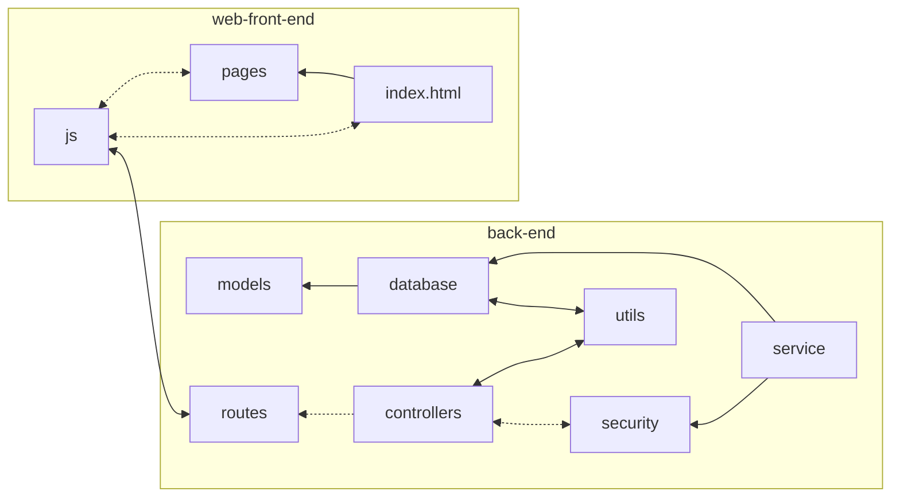

# README

Quest 1 source code and Quest 2 source code has similar structures so you
can relate some similarities between these two codebases.

## File Structure

```
.
├── back-end
│   ├── app.js
│   ├── controllers
│   │   └── authController.js
│   ├── models
│   │   └── UserModel.js
│   ├── package.json
│   ├── package-lock.json
│   ├── README.md
│   ├── routes
│   │   └── authHandling.js
│   ├── service
│   │   ├── database
│   │   │   └── db.js
│   │   └── security
│   │       └── authentication.js
│   └── utils
│       └── helper.js
└── web-front-end
    ├── index.html
    ├── js
    │   └── scripts.js
    ├── pages
    │   ├── profile.html
    │   └── register.html
    ├── README.md
    └── styles
        └── styles.css

13 directories, 16 files
```

The directory structure for the code of Quest 1 follows this scheme. Each directory has a `README.md` (some not shown in the `tree`) explaining the purpose and the rationale
for each code.

> [!IMPORTANT]
> It is recommended to read through each `README.md` file as they contain information that you might need for further understanding of the campaign.

## Where to read first?

There is no given order to read through each directory. However, we do recommend this flowchart to know how interconnected they are.



